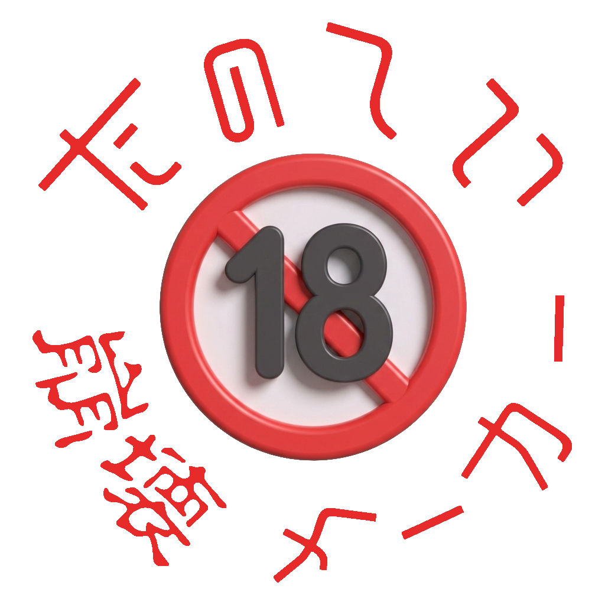
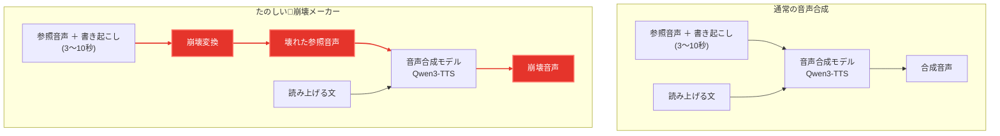

<p align="center">
  
</p>

<h1 align="center">たのしい🔞崩壊メーカー</h1>

<p align="center">任意のテキストを、任意の声で読ませて、<b>壊す</b>ツール。</p>

---

- 好きな文章を、プリセットのキャラの声か、手持ちの音声ファイルの声で読ませる
- **崩壊エフェクト**で、じわじわ壊れていく音声を作る
- **冒頭の数秒だけ正常に喋らせて、区切りのいいところから崩壊へ移る**

音声合成は [Qwen3-TTS](https://github.com/QwenLM/Qwen3-TTS) のゼロショット音声クローン。
**本プロジェクトは Qwen / Alibaba とは無関係です。**

---

## 普通の音声合成と何が違うのか

<p align="center">
  
</p>

**違いは 1 箇所だけ。参照音声を壊してからモデルに渡します。**
出力を後からエフェクトで加工しているのではありません。



**音声合成モデルは上下で同じもの**です。読み上げる文もそのまま渡します。
壊しているのは「どんな声で読むか」を決める参照音声のほうだけで、
だから**崩れても同じ人の声のまま**になります。

---

## サンプル

<!-- SAMPLES:BEGIN -->

> [!WARNING]
> ⚠️ 音量注意 (音割れ発生することがあります)

> [!NOTE]
> GitHub のプレイヤーは**既定でミュート**です。▶ を押したあと **🔊 を押すと音が出ます**。
>
> プレイヤーごとに押すのが面倒なら、**ブラウザの開発者ツール (F12) のコンソール**に下を貼って実行すると、このページの全プレイヤーが一度にミュート解除されます (**音量を下げてから**どうぞ)。
>
> ```js
> document.querySelectorAll('video').forEach(v => { v.muted = false; v.volume = 1 });
> ```

読み上げテキスト: <sub>窓の外では雨が降り続いていて、遠くの山はもう見えなくなっていた。彼女は本を閉じて、しばらくそのまま座っていた。</sub>

| 参照音声 | 🟢 通常 | 🟡 崩壊前夜 | 🔴 完全崩壊 |
|---|---|---|---|
| <b>文月 乃亜</b> <sub>(ふみづき のあ)</sub><br><video src="https://github.com/user-attachments/assets/11007198-914e-4e08-9a5a-9a1e8f46bdd6"></video><br><sub>11.5s</sub> | <video src="https://github.com/user-attachments/assets/76fa1cf6-5dc0-43d6-8566-d524298546a3"></video><br><sub>seed 1</sub> | <video src="https://github.com/user-attachments/assets/f36000ad-6d7d-47cf-acee-13b42f064f09"></video><br><sub>seed 1</sub> | <video src="https://github.com/user-attachments/assets/46d62add-f3a3-4735-98e7-41623d67d192"></video><br><sub>seed 842759</sub> |
| <b>沢渡 ゆめ</b> <sub>(さわたり ゆめ)</sub><br><video src="https://github.com/user-attachments/assets/1e151a6d-4316-4e7f-881e-15a0f4e1a628"></video><br><sub>11.0s</sub> | <video src="https://github.com/user-attachments/assets/0394205e-5034-4704-b4a2-7095031f52c6"></video><br><sub>seed 1</sub> | <video src="https://github.com/user-attachments/assets/9b3f3985-df6e-4675-9ca9-c0fa36152f75"></video><br><sub>seed 111</sub> | <video src="https://github.com/user-attachments/assets/e3024110-19e5-4e0f-9d9c-c2fa2fd6e200"></video><br><sub>seed 400400</sub> |
| <b>御影 司</b> <sub>(みかげ つかさ)</sub><br><video src="https://github.com/user-attachments/assets/1fdca547-2b03-4fa5-a6d2-f769a9d3ef35"></video><br><sub>13.4s</sub> | <video src="https://github.com/user-attachments/assets/e89daf6d-e117-4204-be8f-3882811a6924"></video><br><sub>seed 7</sub> | <video src="https://github.com/user-attachments/assets/c10ef42a-b535-4057-a50e-a5b5b02a213b"></video><br><sub>seed 7</sub> | <video src="https://github.com/user-attachments/assets/6a6ee4c0-7743-4981-aa95-7fb26838d1b7"></video><br><sub>seed 752224</sub> |
| <b>御影 怜香</b> <sub>(みかげ れいか)</sub><br><video src="https://github.com/user-attachments/assets/cc87b2e5-ff88-4ad2-be22-ff21f6c5ca82"></video><br><sub>14.7s</sub> | <video src="https://github.com/user-attachments/assets/bfb33811-1541-4cc1-b670-42d399eb429b"></video><br><sub>seed 1</sub> | <video src="https://github.com/user-attachments/assets/9d7fca3e-9c04-4e6e-b1d5-62c690b20062"></video><br><sub>seed 105</sub> | <video src="https://github.com/user-attachments/assets/1638f9b4-338c-4aac-a2d6-c319c007299c"></video><br><sub>seed 302</sub> |
| <b>御影 すず</b> <sub>(みかげ すず)</sub><br><video src="https://github.com/user-attachments/assets/4da882e3-b04e-4663-9560-9e25808b2be3"></video><br><sub>13.1s</sub> | <video src="https://github.com/user-attachments/assets/3c129e8e-7890-4129-b737-3192d231b969"></video><br><sub>seed 1</sub> | <video src="https://github.com/user-attachments/assets/969f7e94-b16c-4815-aabd-e095dc6a2f49"></video><br><sub>seed 1</sub> | <video src="https://github.com/user-attachments/assets/fbfe4d5e-5d0c-4616-86ba-3222d2a8b4e3"></video><br><sub>seed 983820</sub> |
| <b>久遠 霞</b> <sub>(くおん かすみ)</sub><br><video src="https://github.com/user-attachments/assets/62b50e30-8f90-4c87-b4b7-f8c210153605"></video><br><sub>13.3s</sub> | <video src="https://github.com/user-attachments/assets/56bb7d67-67c2-45eb-b2d0-f57968b7d568"></video><br><sub>seed 1</sub> | <video src="https://github.com/user-attachments/assets/460375c3-3df7-44cb-956a-3938cae41dcb"></video><br><sub>seed 1</sub> | <video src="https://github.com/user-attachments/assets/1568599c-0da9-46f5-9a75-dd194f5a6330"></video><br><sub>seed 251662</sub> |
| <b>柊 律</b> <sub>(ひいらぎ りつ)</sub><br><video src="https://github.com/user-attachments/assets/9a77baed-162d-426b-bb56-dca460c9f653"></video><br><sub>15.0s</sub> | <video src="https://github.com/user-attachments/assets/e8c90ec9-4d9f-4e2b-aa38-4b38e1acbca1"></video><br><sub>seed 7</sub> | <video src="https://github.com/user-attachments/assets/b476de98-ca72-4749-b453-433667284b52"></video><br><sub>seed 145139</sub> | <video src="https://github.com/user-attachments/assets/1711eef4-0712-43bb-8385-cce3df071798"></video><br><sub>seed 461936</sub> |
| <b>プリヤ・シャルマ</b><br><video src="https://github.com/user-attachments/assets/3650505b-ac32-4931-96af-7e4c89f9101d"></video><br><sub>12.9s</sub> | <video src="https://github.com/user-attachments/assets/2ca554bf-b8b5-4648-9b46-a4ca75214676"></video><br><sub>seed 1</sub> | — | — |
| <b>mossan_hoshi</b><br><video src="https://github.com/user-attachments/assets/02d6239e-caf3-41ff-9d72-2f05365bce6c"></video><br><sub>15.0s</sub> | <video src="https://github.com/user-attachments/assets/93999376-ca14-4d1f-a2e7-8c19317b7e2f"></video><br><sub>seed 1</sub> | <video src="https://github.com/user-attachments/assets/25627710-c300-4948-952b-418e7eaa1f47"></video><br><sub>seed 280860</sub> | <video src="https://github.com/user-attachments/assets/9ce6894c-14a2-4082-ab1f-fb9c58ee135e"></video><br><sub>seed 903948</sub> |

<!-- SAMPLES:END -->


---

## キャラクターについて

<p align="center">
  
</p>

本ツールに出てくるキャラクターは、小説などを**漫画・挿絵本・図解本**にする
AI 画像読書アプリ **「のべつべ！」** の、**文章読み上げ (TTS) 用オリジナル音声モデル**の
キャラクターです。**2026 年中に Android アプリと Web 版をリリース予定です。**

---

## 使い方

**キャラのタイルを選び、文章を入れ、崩壊度のつまみを決めて生成する**だけです。
参照音声は `refs/` に同梱しています。

つまみは 3 段階で、間は連続的に変わります。動かすと**キャラのタイルの絵も一緒に変わります**。

| | |
|---|---|
| 通常 | 素の生成 |
| 崩壊前夜 | じわじわ壊れる |
| 完全崩壊 | 原形が残らない |

「あなた専用キャラ」を選ぶと手持ちの音声ファイル (wav / mp3 / m4a / flac / ogg) を
読み込めます。24kHz mono へ自動変換し、**書き起こしも自動で作ります**
（ゼロショットは参照音声の書き起こしが必須なため）。

<details>
<summary><b>詳しい挙動</b>（参照音声・崩壊の効き方・生成尺・音割れ）</summary>

### 参照音声

数秒〜十数秒が目安です。**端の無音は必ず落とします**（既定で ON）。
無音が残っていると出力の間が 0.4〜0.9 秒に伸びて「途中で音が途切れた」ように聞こえます。
ゼロショットは参照の音響特性をそのまま写すためです。

### 崩壊

崩壊は**参照音声のほうを壊す**ことで起こします。サンプリング温度をいくら上げても
（8.0 まで確認）崩れません。

**確率的で、参照が長いほど確実に効きます**（実測: 11.5 秒で 3/3、3.8 秒で 2/3、
5.0 秒で 1/3）。崩れなかったらシードを変えて引き直してください。
シードを固定すれば同じ結果がビット単位で再現されます。
長い文ほど崩れ方が深くなります（崩壊は進行するため）。短文だと崩れきる前に終わります。

### 冒頭は正常に喋らせる

崩壊は早く始まりすぎることが多いので、**頭の数秒は普通に喋らせて、そこから崩します**。
接合位置は正常側の息継ぎ・読点の無音を自動で探し、指定範囲の中からランダムに選びます。
崩壊側も同じ時刻付近の区切りから採るので、同じ語を二度言いません。
**この設定では生成が 2 回走る**ので、所要時間は倍になります。

### 生成尺

`max_new_tokens ÷ 12.5 = 秒数`。崩壊時はこの上限まで喋り続けます。
上限があるので**無限ループにはなりません**。

### ⚠️ 音割れ

崩壊させると音が割れることがあります。**これは後処理では直りません。**
Qwen3-TTS のボコーダが最終段で `±1.0` にハードクランプしており、
超過分はこちらが受け取る前に潰されているためです。正常部は割れません。
気になる場合は崩壊を弱めてください。

</details>

---

## 動かす

| | |
|---|---|
| Python | 3.10〜3.12 |
| GPU | CUDA 8GB 以上を推奨。CPU でも動くが実用にならない速度 |
| ディスク | モデルに約 3.4GB |

<details>
<summary><b>セットアップ手順</b></summary>

```bash
git clone https://github.com/mossan-hoshi/happy-collapse-maker
cd happy-collapse-maker

python -m venv .venv
# Windows: .venv\Scripts\activate     macOS/Linux: source .venv/bin/activate

# torch だけは環境に合わせて先に入れる
pip install torch torchaudio --index-url https://download.pytorch.org/whl/cu126  # NVIDIA
# pip install torch torchaudio                                                   # macOS
# pip install torch torchaudio --index-url https://download.pytorch.org/whl/cpu  # CPU

pip install -r requirements.txt

# モデルを落とす (約 3.4GB)。再実行しても既にある分は落とし直さない
python setup_model.py

python app.py
```

ブラウザが `http://127.0.0.1:7860` で開きます。

> **Hugging Face のトークンは必須ではありません。**公開モデルなので匿名でも落ちますが、
> レート制限に当たったら [トークン](https://huggingface.co/settings/tokens) を作って
> `HF_TOKEN` に入れてください。**ここだけは手動です。**

モデルの場所は次の順で探します。

1. `--model <パス>`
2. 環境変数 `QWEN_TTS_MODEL`
3. `./model`（`setup_model.py` の既定の置き場所）

> **`--model` に Hugging Face の repo id を渡さないこと。** 通信で数分ハングします。
> 必ずローカルのパスを渡してください。

</details>

<details>
<summary><b>バイナリを作る</b>（Windows / macOS）</summary>

```powershell
pwsh ./build_windows.ps1 -Venv D:\path\to\.venv
```

- **onedir 固定。onefile にはしない。** torch と CUDA ランタイムだけで数 GB あり、
  onefile は起動のたびに全部を temp へ展開するため起動に数分かかる
- UPX は使わない。torch / CUDA の DLL を壊すことがある
- **モデルは同梱されない。**配布先で `setup_model.py` を実行するか、
  exe と同じ場所に `model/` を置く

**PyInstaller はクロスコンパイルできない**ため、macOS 向けバイナリを Windows では作れません。
上のセットアップ手順でそのまま動きます。自分でバイナリにするなら macOS 上で:

```bash
pip install pyinstaller
pyinstaller qwen_tts_studio.spec --noconfirm
```

- **Apple Silicon に CUDA はありません。** MPS（Metal）か CPU で動きます
- **MPS での動作は未検証**です。fp16 の一部演算が MPS 未対応で落ちる場合は
  `python app.py --device cpu` に落としてください
- **CPU は実用になりません。** 1.7B の自己回帰デコードは 1 フレームずつ進むため、
  CUDA でも RTF 4〜5（10 秒の音声に 40〜50 秒）かかります

</details>

<details>
<summary><b>開発用のスクリプト</b></summary>

| | |
|---|---|
| `python test_guard.py` | 多重起動ガードと参照の許可リストの回帰テスト（モデルを読まない） |
| `python make_samples.py` | 上のサンプル音声と表を生成（モデルが要る） |
| `python make_chibi_collapse.py` | キャラタイルの崩壊版を生成（Gemini API キーが要る） |
| `python make_logo.py` | タイトルロゴを生成（同上） |

実装上の注意点は [DEVNOTES.md](DEVNOTES.md) にまとめてあります。

</details>

---

## ⚠️ 使う前に

本ツールは**ジョークアプリ**です。**数秒の音声から実在の人物の声を再現**でき、さらにその声を
**壊れていく音**にできます。使い方次第で人を傷つけます。
**[TERMS.md](TERMS.md) を読んでから使ってください。** 要点だけ:

- **本人の許可を得ていない声で生成しない。** 同梱の音声も実在の人物の声です。
  話者本人の発言として扱わないでください
- **なりすまし・誹謗中傷・嫌がらせに使わない**
- **声紋認証など、音声を本人性の根拠にしている仕組みを欺かない**
- **事故・事件・緊急事態を装わない。** 崩壊音声は「人が苦しんでいる」ように聞こえます。
  偽の救助要請に転用しないでください
- **公開するときは AI 生成だと明示する**（EU AI Act 第 50 条ほか）
- **生成物に起因する損害に作者は一切の責任を負いません**

### 同梱しているプリセット音声について

**出所が 2 種類あります。**

- **ほとんどは [Common Voice](https://commonvoice.mozilla.org/) 日本語コーパス**
  (cv-corpus-25.0-2026-03-09-ja) で、**CC0 1.0（パブリックドメイン）**で公開されている
  ものです。加工は**無音の除去と連結のみ**で、内容は改変していません。**話者は匿名です。**
  Common Voice は寄贈者を匿名で公開しており、**誰の声なのかは特定できません。**
  作者も知りませんし、特定しようともしていません。**発話者を貶めたり、
  不快にさせる意図は一切ありません**
- **1 キャラだけ mossan_hoshi 本人の声です** (`refs/mossan_hoshi/`)。**CC0 ではありません**
  ——生成して遊ぶ・共有する・SNS に投稿するといった個人利用は自由ですが、
  **音声ファイルそのものの再配布・AI 学習データとしての利用・他サービスへの投入は禁止**
  です。詳しくは [TERMS.md](TERMS.md) 1-4

Common Voice 由来の音声を使う方は、**話者の身元を特定しようとしないでください**
（Common Voice の利用規約でも禁じられています）。→ [TERMS.md](TERMS.md) 1-2

> **万一、該当音声の寄贈者ご本人から申し出があれば、速やかに取り下げます。**
> `novtube-support@mossan-hoshi.com` までご連絡ください。

---

## ライセンス

**コードは** [Apache License 2.0](LICENSE) ＋ [追加の利用条件](TERMS.md)。

| | |
|---|---|
| コード | Apache-2.0 ＋ 追加条件 |
| `assets/chibi*/`・ロゴ類 | **ライセンス対象外。** 転載・改変・再配布不可 |
| `refs/mossan_hoshi/` | **CC0 ではない。**ファイル自体の再配布・学習データ利用は不可 → [TERMS.md](TERMS.md) 1-4 |
| その他の `refs/*.wav` | **CC0 1.0 ＋「話者を特定しない」**（Common Voice）→ [CREDITS.md](CREDITS.md) |
| モデル | 非同梱。Qwen3-TTS (Apache-2.0) を各自で取得 |

> 利用目的に制限を設けているため、**本ソフトウェアは OSI 定義の「オープンソース」ではありません。**
> 単に「Apache-2.0」とだけ呼ばないでください。
